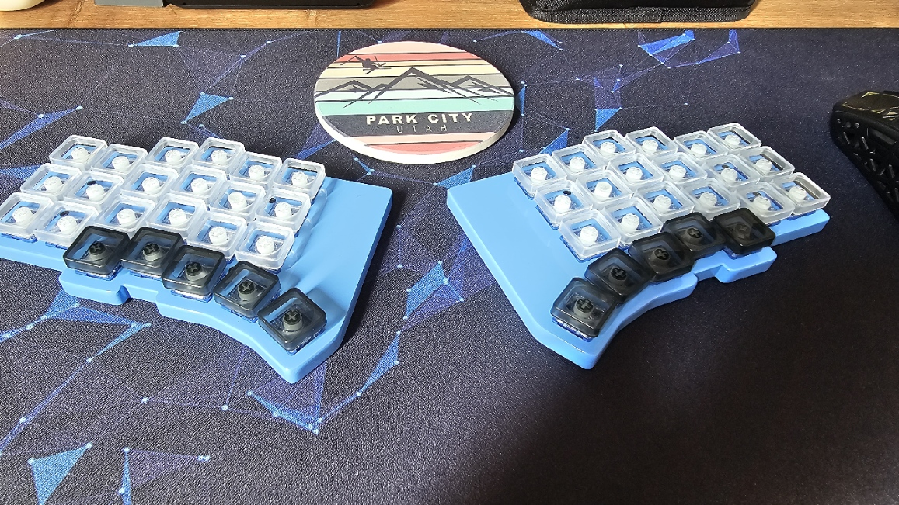
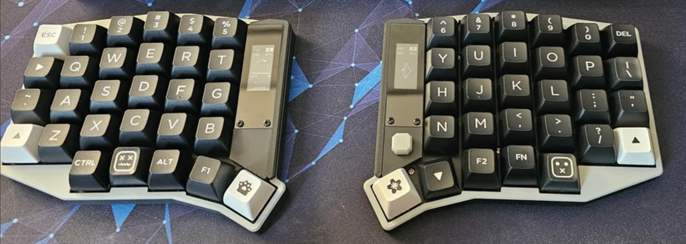

# ZMK Firmware configuration for my keyboards

This repo contains the ZMK firmware configuration for my keyboards, including the Anywhy Flake and the Eyelash Sofle. It includes custom keymaps, build configurations, and shield overlays for these keyboards.

## Anywhy Flake

This is the ZMK firmware for the [Anywhy Flake](https://github.com/anywhy-io/flake) keyboard with my custom keymap.

The original keymap is available at <https://github.com/anywhy-io/flake-zmk-module> and the Flake keyboard project is at <https://github.com/anywhy-io/flake>.

## Eyelash Sofle

This is the ZMK firmware for the Eyelash Sofle keyboard with my custom keymap. The build configuration includes both the central dongle and standalone versions of the keyboard.

